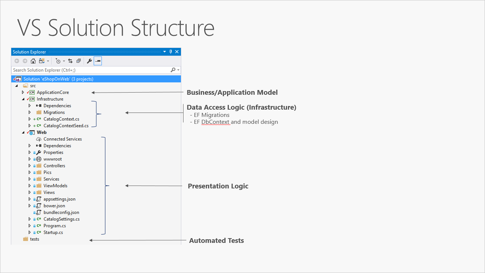

# Overview
In this solution we will try to create basic structure (N-Layered) [ASP.NET Core](https://dotnet.microsoft.com/download/dotnet-core/3.1) web application.
We will try to cover the following topics
- Create structure with some explanation
- Configure DI
- Configure EF
- Add Unit Tests

# Creating Project Structure
Below an example how to do it within command line and .NET Core installed.
We will try to re-create application layers from Microsoft article "[Common web application architectures](https://docs.microsoft.com/en-us/dotnet/architecture/modern-web-apps-azure/common-web-application-architectures)"

One of representation of Clean/Onion/Hexagonal Architecture in simple form may look as following


That should match the following Solution Structure



```
dotnet new sln -o ClassesTimetable
cd ClassesTimetable
dotnet new classlib -o ClassesTimetable.Core
dotnet new classlib -o ClassesTimetable.Infrastructure
cd ClassesTimetable.Infrastructure
dotnet add package Microsoft.EntityFrameworkCore --version 2.2.0
dotnet add package Microsoft.EntityFrameworkCore.Tools --version 2.2.0
dotnet add package Microsoft.EntityFrameworkCore.SqLite --version 2.2.0
dotnet add package Microsoft.EntityFrameworkCore.Design --version 2.2.0
cd ..
dotnet new mvc -o ClassesTimetable.Web
dotnet new xunit -o ClassesTimetable.Tests

dotnet add ClassesTimetable.Infrastructure/ClassesTimetable.Infrastructure.csproj reference ClassesTimetable.Core/ClassesTimetable.Core.csproj

dotnet add ClassesTimetable.Web/ClassesTimetable.Web.csproj reference ClassesTimetable.Core/ClassesTimetable.Core.csproj

dotnet add ClassesTimetable.Web/ClassesTimetable.Web.csproj reference ClassesTimetable.Infrastructure/ClassesTimetable.Infrastructure.csproj

dotnet add ClassesTimetable.Tests/ClassesTimetable.Tests.csproj reference ClassesTimetable.Core/ClassesTimetable.Core.csproj

dotnet add ClassesTimetable.Tests/ClassesTimetable.Tests.csproj reference ClassesTimetable.Infrastructure/ClassesTimetable.Infrastructure.csproj

dotnet sln ClassesTimetable.sln add ClassesTimetable.Core/ClassesTimetable.Core.csproj
dotnet sln ClassesTimetable.sln add ClassesTimetable.Infrastructure/ClassesTimetable.Infrastructure.csproj
dotnet sln ClassesTimetable.sln add ClassesTimetable.Web/ClassesTimetable.Web.csproj
dotnet sln ClassesTimetable.sln add ClassesTimetable.Tests/ClassesTimetable.Tests.csproj
```
